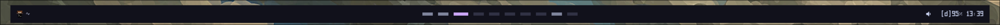

# my shell (it's not very quick)

---

A kinda usable bar written in gtkmm4.

TODO:
- [ ] hyprland
  - [x] workspaces
  - [x] active window title
  - [ ] changing layouts per workspace
- [ ] config
  - [x] basic ini config
  - [ ] vertical bar
  - [ ] configurable module positions
- [ ] systray
